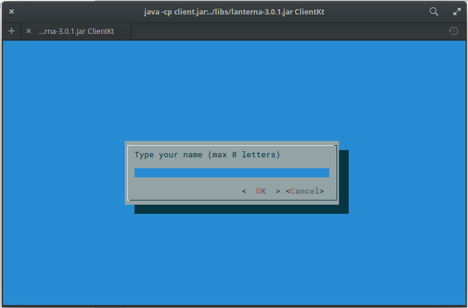
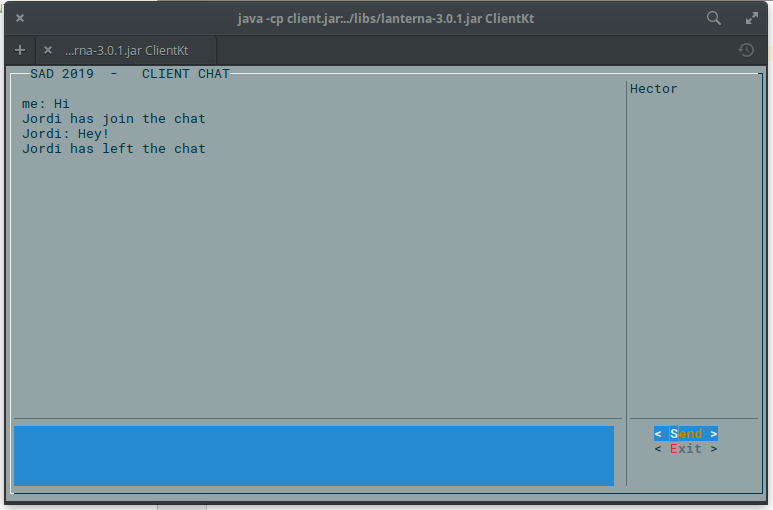

# Lanterna chat in kotlin

## Request name screen

## Chat screen

## Compiling server and client :

### Server:

~~~
kotlinc MyServerSocket.kt MySocket.kt Server.kt -include-runtime -d server.jar
~~~

### Client :

~~~
kotlinc -cp ../libs/lanterna-3.0.1.jar Client.kt FirstGUI.kt KeyStrokeListener.kt MySocket.kt  -include-runtime -d client.jar
~~~

## Running server and client :

## Server (must be run first)

~~~
java -jar server.jar
~~~

## Client :

~~~
java -cp client.jar:../libs/lanterna-3.0.1.jar ClientKt
~~~

